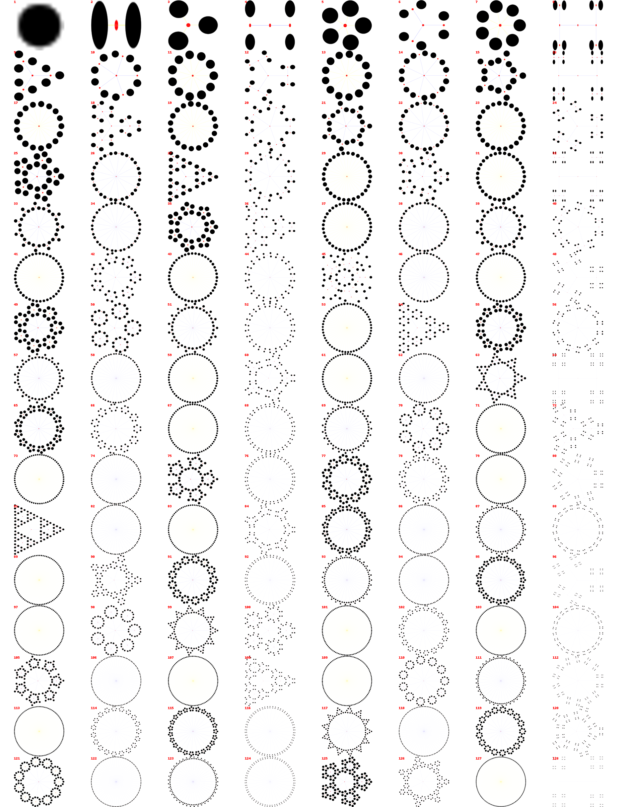

# number-factorization-diagrams
## Description

Factorization diagrams are depictions of numbers using dots but grouped by factors. They were invented by PhD student Brent Yorgey. 

This visualization helps us track the prime factors that compose a given number. We can easily identify primes when we arrive to a
simple circle (i.e. a prime cannot be composed of smaller divisors). We can also identify common patterns of smaller prime divisors
e.g. `2`, `3`, `5`



## Instalation

In order to install this package, you must run the following command:
```bash
$ pip install factodiagrams
```
(pypi link : https://pypi.org/project/factodiagrams/)

## Structure

```bash
< PROJECT ROOT >

   |
   |-- github/workflows.          # Continuous integration hook action    
   |-- beamer/                    # Beamer latex code source
   |-- doc/                       # Sphinx documentation files
   |-- examples/                  # Provides examples to use factorization package
   |-- factodiagrams/             # Sources code of the project
   |    |-- preprocess/           # Factorisation and diagram drawing functions
   |    |-- test/                 # Test functions 
   |    |-- vis/                  # Visualization functions
   |    |
   |-- report/                    # Notebooks for the main functions of the package using source code and pypi installed package
   |-- requirements.txt           # Development modules 
   |-- work_organization.md       # Resume the work's organization
   |-- poster.png                 # Poster example generated for this project
   |
   |-- setup.py                   # Installation package file
   |-- ************************************************************************
```
## Contributers
```
Bouthayna HAYOU : bouthayna.hayou@etu.umontpellier.fr
Juliette LIDOINE : juliette.lidoine@etu.umontpellier.fr
Sidy SOW : sidy.sow@etu.umontpellier.fr
Louis NGUYEN : louis.nguyen@etu.umontpellier.fr
```
